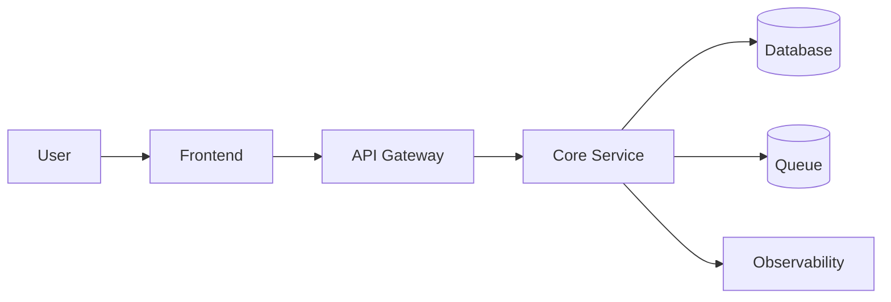
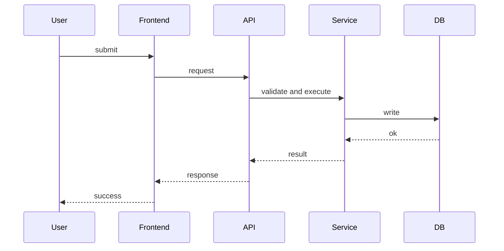
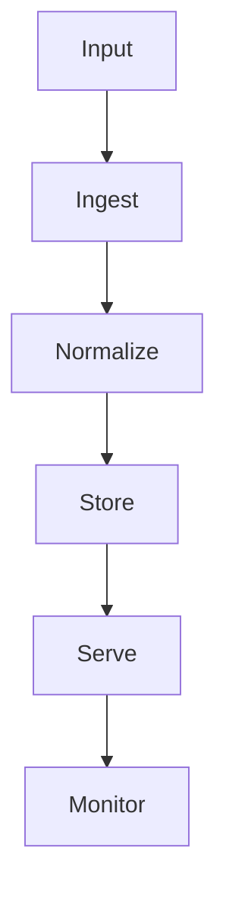

# 画图模式

建议使用 Mermaid

## 系统上下文图

```mermaid
flowchart LR
  U[User] --> FE[Frontend]
  FE --> API[API Gateway]
  API --> SVC[Core Service]
  SVC --> DB[(Database)]
  SVC --> MQ[(Queue)]
  SVC --> OBS[Observability]
```

## 关键链路时序图

```mermaid
sequenceDiagram
  participant U as User
  participant FE as Frontend
  participant API as API
  participant SVC as Service
  participant DB as DB

  U->>FE: submit
  FE->>API: request
  API->>SVC: validate and execute
  SVC->>DB: write
  DB-->>SVC: ok
  SVC-->>API: result
  API-->>FE: response
  FE-->>U: success
```

## 数据流图

```mermaid
flowchart TD
  A[Input] --> B[Ingest]
  B --> C[Normalize]
  C --> D[Store]
  D --> E[Serve]
  E --> F[Monitor]
```